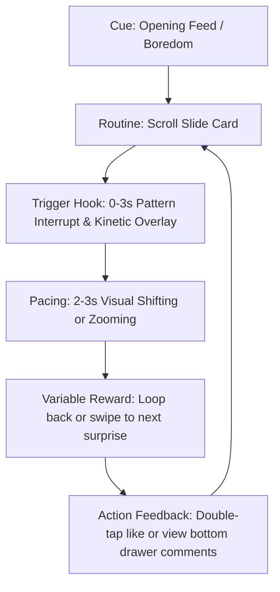

# Mobile UX & Attention Retention Research Report

This report consolidates the findings of two independent research agents triggered to study best practices for vertical mobile screen layouts and attention-retention design. 

---

## 📖 Research Index & Summaries

### 📱 Portrait Layout & Ergonomics
This section covers structural layout, visual hierarchy, touch patterns, and reading behaviors on vertical screens.

#### 1. Visual Hierarchy & Scanning
*   **Compressed F-Pattern:** Mobile users scan vertically along the left edge. High-impact keywords must be front-loaded in the first 1-2 words.
*   **Zigzag Scanning:** Landing pages should lead down from a top-left starting point, winding down to a bottom call-to-action (CTA).
*   **Central Focal Bias:** Viewers focus on the middle vertical third of the viewport (between 30% and 70% screen height). They scroll content up rather than looking down.

#### 2. Touch Ergonomics & Safe Zones
*   **The Thumb Zone:** Steven Hoober's research shows the bottom 1/3 is the natural sweep area (ideal for CTAs/navigation), the middle 1/3 is the stretch area, and the top 1/4 is the hard-to-reach zone (reserved for passive info/settings).
*   **Tap Targets:** Minimum target sizing of 44x44 pt (iOS) or 48x48 dp (Android). Padding should be used to expand the interactive zone of smaller visual elements.
*   **Device Safe Zones:** Sticky headers and floaters must use CSS environment variables (`env(safe-area-inset-top)` and `env(safe-area-inset-bottom)`) to prevent notch or gesture bar overlap.

#### 3. Typography & Ratios
*   **Scale & Line Width:** Base font size >= 16px. Ideal line length is 30 to 50 characters (`30ch`-`40ch`). 
*   **Line Spacing:** Line height of 1.5–1.6 for body copies, and 1.1–1.2 for compact heading blocks.
*   **Aspect Ratios:** Always define layout frames to avoid Cumulative Layout Shift (CLS) using `aspect-ratio: 9/16` or similar. Use `object-fit: cover` with proper `object-position` to avoid distortion while cropping.

### 🎯 Attention & Retention Mechanics
This section covers behavioral psychology, feed loop engineering, and feedback loops to retain user attention.

#### 1. The Hook Paradigm (First 3 Seconds)
*   **Pattern Interrupts:** Break the scroll-induced hypnotic trance with a scale contrast (extreme zoom cuts), frame disruption (rapid pan), or sudden lighting changes.
*   **Sound-Off Design:** Unmuted feeds are rare—up to 80% of feed consumption is muted. Use *kinetic typography* (displaying 1-3 spoken words dynamically in sync with audio) placed in the upper-middle third of the viewport.
*   **Reverse Sequencing:** Show the ending or final value first, then step back to the process.

#### 2. Content Pacing & Loops
*   **Visual Shift Rule:** Maintain arousal by shifting the visual frame, zooming, or adding overlays every 2-3 seconds.
*   **Audio De-noising:** Edit out pauses, filler words, and breaths using aggressive jump cuts.
*   **Infinite Loop Design:** Craft loops where the final frame grammatically or visually feeds directly back into the opening frame (e.g. *"...use standard forms without validation"* looping into *"This is why you should never..."*).

#### 3. Interaction Loops & Haptics
*   **Double-Tap to Like:** Enable screen-body double-taps to generate floating bubble effects (scale bounce + drift fade) to drive low-friction engagement.
*   **Frictionless Drawers:** Sliding interactive panels (comments, shares) up from the bottom covering 60-70% of screen size keeps the main feed looping in the background.
*   **Variable Reward Schedule:** Leverage the slot-machine effect. Randomize feed quality to trigger anticipation, which prompts continuous scrolling.

---

## 🛠️ Codebase Checklist: Aligning findings with the Brief Project

Below is an action checklist comparing our codebase to mobile best practices, with links to the corresponding files:

| Feature & Code Location | Best Practice Finding | Action Item / Recommendation | Status |
| :--- | :--- | :--- | :--- |
| **Scroll Snapping**  [MobileSimulatorFeed.tsx](file:///Users/huynq/Learn/brief/src/widgets/mobile-simulator-feed/ui/MobileSimulatorFeed.tsx#L15) | Scroll container uses `snap-y snap-mandatory` | Ensure smooth snapping transitions are customized using a premium spring-like easing curve. | ⚠️ Implemented (Basic) |
| **Central Focal Bias**  [SlideCard.tsx](file:///Users/huynq/Learn/brief/src/entities/slide/ui/SlideCard.tsx#L40-L47) | Center content box is positioned vertically near middle-top | Adjust margins to ensure the card stays vertically centered during viewport snapping. | ✅ Aligned |
| **Action Column Placement**  [SlideCard.tsx](file:///Users/huynq/Learn/brief/src/entities/slide/ui/SlideCard.tsx#L71-L78) | Interactive actions (Like, Share) are in the bottom-right column | Excellent placement within Steven Hoober's **Thumb Zone** model for single-handed reach. | ✅ Aligned |
| **Muted Sound State**  [SlideCard.tsx](file:///Users/huynq/Learn/brief/src/entities/slide/ui/SlideCard.tsx#L65-L68) | Static "Music" indicator shows spinning spin state | Implement actual audio support with tap-to-toggle mute control in the top-right stretch zone. | 🛠️ Backlog |
| **Frictionless Drawers**  [MobileSimulatorFeed.tsx](file:///Users/huynq/Learn/brief/src/widgets/mobile-simulator-feed/ui/MobileSimulatorFeed.tsx#L33-L56) | Comment, Save, and Share buttons are basic empty buttons | Replace simple buttons with a sliding bottom drawer overlay (bottom 60% of viewport) to view comments/share metrics without breaking slide loop. | 🛠️ Backlog |
| **Double-Tap Interaction**  [SlideCard.tsx](file:///Users/huynq/Learn/brief/src/entities/slide/ui/SlideCard.tsx#L28-L29) | No current double-tap gesture handler | Add a double-tap gesture listener to the slide background that increments the like counter and spawns a temporary spring-scaling heart animation on the tap coordinates. | 🛠️ Backlog |

---

## 🧠 Retention Loops Flow

Below is the design loop for retaining user attention during feed navigation:

